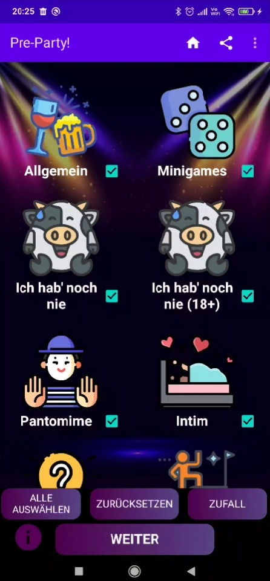
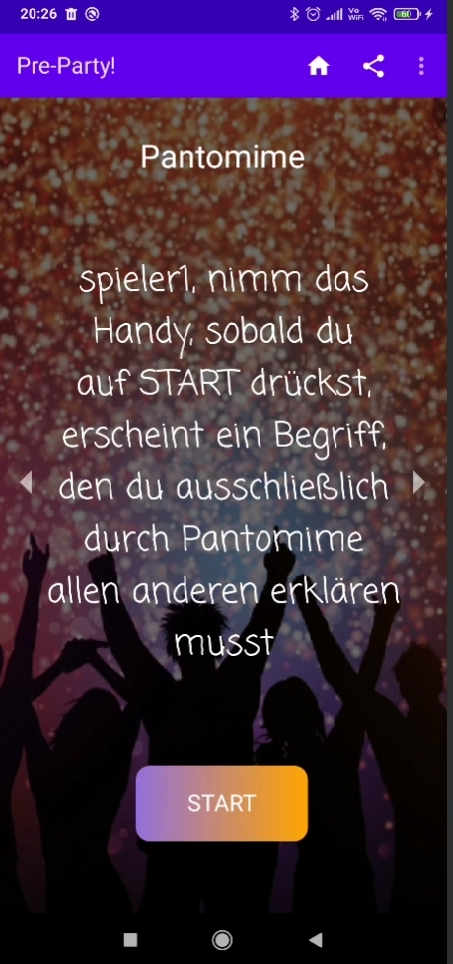

# Portfolio
Hier befinden sich einige meiner privaten Projekte sowie Hochschulprojekte, die ich in GitHub verwalte. Eine nähere Einsicht in die privaten Projekte und den Code ist nur auf Anfrage möglich.

Die Projekte sind weder in einer zeitlichen Reihenfolge noch nach Wichtigkeit geordnet.

  
---

  
## 🌍 Projekt 1: Ordinary-Website
### Kleines Spaß-Projekt, deployte Website für Freunde bzw. E-Sports Team "Ordinary" (Mit Humor nehmen! 😄) (Noch in Entwicklung)
https://ordinary.eu.pythonanywhere.com/ordinary/  
Technologien: HTML, CSS, JS, Django (Python), SQL (SQLite DB), Visual Studio Code

  
---

  

## 🍻 Projekt 2: Trinkspiel-Android-App
### Trinkspiel-App für Android (HS Worms SoSe23, Modul: Entwicklung mobiler Anwendungen)
Technologien: Kotlin, AndroidStudio, SQLite
  
  
  

  
---

  

## 🌍 Projekt 3: Website für E-Sportler "dajor25"
### Meine allererste entwickelte Website. (HS Worms SoSe22, Modul: Webentwicklung) (Teamprojekt)
Technologien: HTML, CSS, JS, Visual Studio Code  

  
---

  

## 📊🤖 Projekt 4: Machine Learning
### Machine Learning Projekt (HS Worms WiSe23/24, Modul: Machine Learning)
Clustering, Classification, Regression  
Technologien: Jupyter Notebook, Python, Numpy, Tensorflow, pandas, etc.

  
---

  

## 🤖🎤💰 Projekt 5: WWM-Alexa-Skill
### Entwicklung eines Wer-Wird-Millionär-Alexa-Skills (HS Worms WiSe22/23, Modul: Digitale Sprachassistenten) (Teamprojekt)
Technologien: Python, SQLite, Alexa-Skill-Kit, Visual Studio Code

  
---

  

## 🎮 Projekt 6: Schiffe-Versenken 
### Entwicklung des Spiels "Schiffe-Versenken" als Desktopanwendung (HS Worms WiSe22/23, Modul: Programmierung Graphischer Oberflächen) (Teamprojekt)
Technologien: Python, PyQT5, Visual Studio Code

  
---

  

## ✍🏻 Projekt 7: Bachelorarbeit  
### Analyse, Konzeption und prototypische Implementierung einer grafischen Benutzeroberfläche und funktionaler Erweiterungen für ein Automatisierungstool zur Installation & Konfiguration von Siemens Opcenter Execution Process
Technologien: C#, WPF (MVVM), Figma, PowerShell

  
---

  

## 🌍 Projekt 8: Fullstack WebShop
### Entwicklung eines Fullstack WebShops (HS Worms SoSe23, Modul: Fullstack Webanwendungen) (Teamprojekt)
Technologien: Nodejs, Docker, MariaDB, Express JS (API), Swagger UI (API Docs), Angular, TailwindCSS, Fontawesome, Jest (Unit-Tests), Visual Studio Code

  
---

  

## 📹 Projekt 9: Among-Us in Blender (HS Worms WiSe2022, Modul: 3D-Modellierung)
### Among-Us-Blender-Project: 3D-Modellierung and Animation eines Among-Us-Kurzfilms (Teamprojekt)
Technologien: Blender, Camtasia  

<video width="640" height="360" controls>
  <source src="media/Alexa-Skill/AmongUsIncidentFilm.mp4" type="video/mp4">
  Dein Browser unterstützt dieses Videoformat nicht.
</video>

  
---

  

## 🤖📧 Projekt 10: Automatischer E-Mail Beantworter "GeniusReply"
### Entwicklung eines automatischen E-Mail Beantworters im achtwöchigen Vollzeitmodul "Teamorientiertes Projekt (TOP)" (HS Worms SoSe24, Modul: Projektmanagement und Teamorientiertes Projekt) (Teamprojekt)
https://top.pages.gitlab.rlp.net/24s/pmai/geniusreply/  
Technologien: Python, LLMs, ChromaDB, JavaScript, MySQL, Nodejs, Visual Studio Code

  
---

