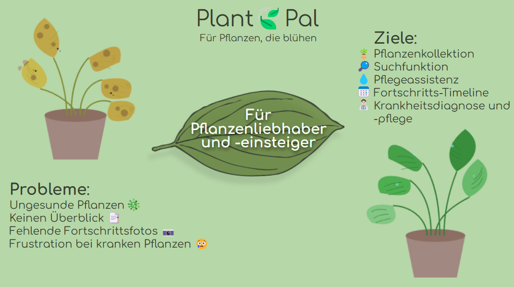
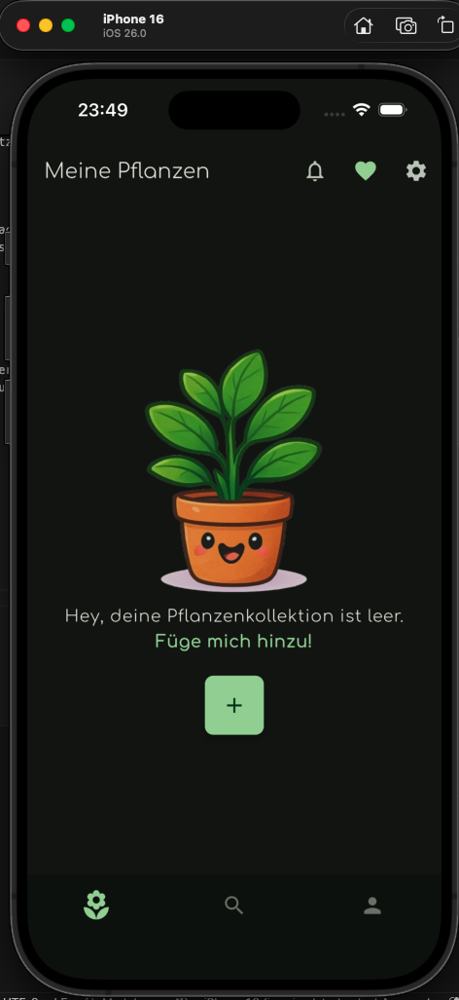
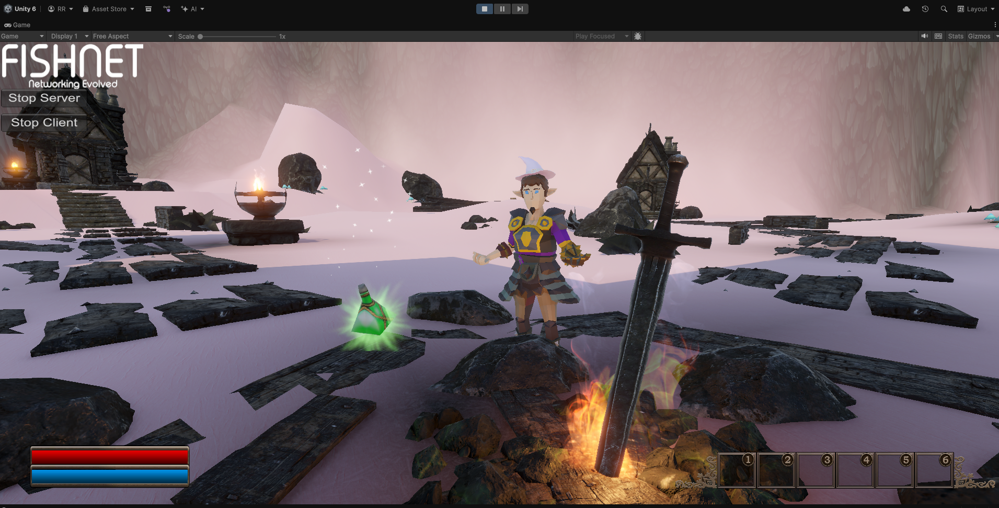
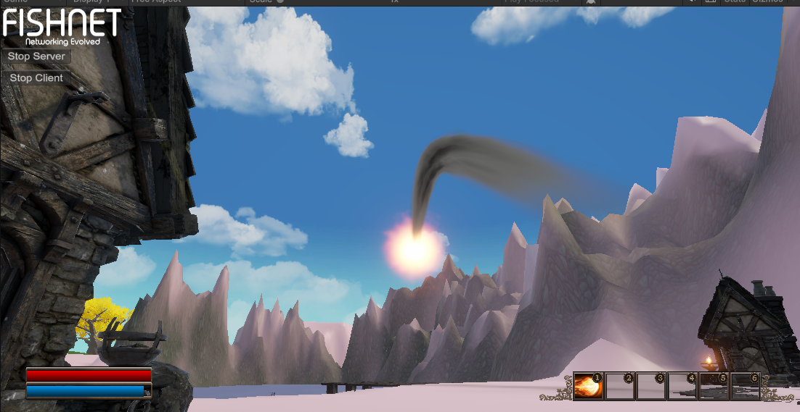

# Project Portfolio - Richard Ryppa

```
print("Initializing portfolio...")  
print("Projects loaded.")  
print("User permissions: read-only")  
print("Ready for exploration.")
```

Welcome!

Here I have gathered several projects on which I have worked independently or collaborated. Not all projects are listed, only the most important and comprehensive ones.

This portfolio is intended to demonstrate my ability to work with a broad range of technologies, learn new tools efficiently, and apply them in practical software projects.

The projects are categorized into [Work](#work-disclaimer-due-to-confidentiality-all-work-related-content-is-kept-non-specific), [University](#university),  and [Leisure](#leisure-fun-projects).

My current main tech stack consists of Python for backend and React (Web) / Flutter (Mobile) for frontend development.

Happy exploring! 

---

## Work (student trainee) 
*Due to confidentiality, work-related content will be kept non-specific*

### 1. 👥 Employee Platform on AWS Infrastructure
**Description/Summary:**  
Improvement and further development of a platform for complete employee management. React frontend and Python backend (AWS Lambdas).  
**My role:**  
Mainly backend development: implementing and deploying new services (Lambdas) as well as making changes to existing ones. This includes deployment, debugging (AWS CloudWatch), bug fixing, secrets management (AWS Secrets Manager), and working with various other AWS services (Aurora/RDS, S3, API Gateway, SNS, SQS, etc.). Additionally, working with Microsoft SharePoint, Azure App Registrations, and the Microsoft Graph API. Minor frontend adjustments related to the corresponding backend services.

**Example features I worked on:**

- New Short-CVM service
- New Profile-Image service
- Significant changes to certification service
- Minor implementations and changes to various other services
- Frontend changes for certification service  

**Tech Stack:** AWS (CDK, Lambda, SQS, SNS, Secrets Manager, RDS, S3, API Gateway), Python, React, Microsoft Graph API, Jira, Docker, Git  
**Timeframe:** 04/2025 - today  
**Team size:** Dynamic, 5-10   

---

### 2. ⏱️ Azure Scheduled Webscraper
**Description/Summary:**  
Development and deployment of an Azure scheduled function for a customer that scrapes information from a website each week and uploads it to the knowledge base of another software via its API.  
**My role:**  Main Developer, implementing all functionalities.  
**Tech Stack:** Azure, Python, External Application API, Git  
**Timeframe:** 09/2025  
**Team size:** 1

---

### 3. 🤖 Azure OpenAI GPT-Realtime Voicebot
**Description/Summary:**  
Research and development of a simple voice bot with WebRTC connection, fuction calling, RAG functionality and displaying audio transcripts as chat messages. Also evaluating the use for a customer.   
**My role:**  Main Developer, implementing all functionalities.  
**Tech Stack:** Azure OpenAI Foundry, Azure GPT Realtime API, Azure AI Search, Azure Blob Storage, Python FastAPI, React, Git     
**Timeframe:** 09/2025 - 11/2025  
**Team size:** 1

---


### 4. 🗓️ Calendar Sync Application
**Description/Summary:**  
 Development of a desktop calendar sync application with a GUI for colleagues from another department. The application reads appointments from an Excel file and writes them to the corresponding Outlook calendar.   
**My role:** Co-Developer, implementing main functionalities, the GUI and delivering it to the colleagues.     
**Tech Stack:**   
Python (FastAPI), MSAL, Microsoft Graph API, Azure App Registration, PYQT5, Git  
**Timeframe:** 04/2025-05/2025  
**Team size:** 2

---

### 5. 🤖 Serving as a contact person for an AI Platform, including documenting it and researching new functionalities
**Description/Summary:**  
Serving as a general contact person for an AI platform and researched new functionalities for it, including how to integrate MCP servers via a mcpo-proxy-server into the locally running, fully containerized setup. I am also responsible for maintaining the platform’s documentation on the internal AI SharePoint.  
**My role:** Developer  
**Tech Stack:** Python, Docker, Azure, Microsoft Sharepoint, Jira   
**Timeframe:** 09/2025 - today  
**Team size:** 1

---

### 6. 📊 Quotation Application
**Description/Summary:**  
 Enhancement of a desktop application used for offer calculation. Adding a wide range of new features, including a complete analytics dashboard, additional cost variables (such as margin) and various functional improvements throughout the application.  
**My role:** Developer  
**Tech Stack:** WinForms (C#), Git  
**Timeframe:** 02/2023-01/2025  
**Team size:** I worked independently with occasional update meetings with one of our project managers

---

### 7. 🎛️ Development of Custom PRTG Sensors
**Description/Summary:**  
 Implementation of various Custom PRTG sensors for a customer project for comprehensive system and service monitoring.  
**My role:** Developer    
**Tech Stack:** PowerShell, SQL    
**Timeframe:** 04/2024-01/2025  
**Team size:** I worked independently with supervision from a colleague 

---

### 8. 📊 Energy Management Desktop Application
**Description/Summary:**  
 Implementation of WinForms Masks for a Energy Management Desktop Application in a customer project.  
**My role:** Developer  
**Tech Stack:** WinForms (C#), SQL, Git  
**Timeframe:** 09/2023-10/2023  
**Team size:** I worked independently with supervision from a colleague 

---

### 9. 📃 Archive-Functionality for an Excel Project Management Sheet
**Description/Summary:**  
 Implementation of an archive feature and several minor enhancements for an Excel sheet used by project managers to manage & track ongoing and past projects.  
**My role:** Developer  
**Tech Stack:** VBA Excel  
**Timeframe:** 01/2024  
**Team size:** 1

---

## University

### 1. 🚗 Schwindibus - Vehicle management and logbook mobile app for private households 
**Module:** Project: System Development  
**Description/Summary:**  
Implementation of a car management cross-platform application in Flutter and GO-Backend with SCRUM.   
**My role:**  
(Full-Stack)-Developer. Implementing API-Endpoints & Bugfixes, Design of Navigation Concept & Screens in Figma. Implementing Screens with backend connection in Flutter.   
**Example features I worked on:**  
- API endpoints for user, vehicle and triplog
- UUIDs for postgres table primary key fields instead of auto-id 
- Figma Designs   
- Vehicle list screen in frontend  

**Tech Stack:**  
 Flutter, Figma, GO Backend with template (https://github.com/vahiiiid/go-rest-api-boilerplate), Postgres, Docker, Git  
**Degree:** Master  
**Timeframe:** WiSe25/26  
**Team size:** 9  
**Grade:** Ungraded  

### 2. 🍃 PlantPal MVP - Plant management mobile app 
**Modules:** Mobile Application Frontend & Interaction Design  
**Description/Summary:**  
 Implementation of a "App Store raedy"  plant management cross-platform application in Flutter. User centered Design & Conception, Frontend and Backend.     
 **My role:**  
 Developer. Implementing Perunual API Interface and screens in flutter with dart using given infrastructure and provided tools/libraries (Riverpod, Dart Mappable, Sembast/Supabase).  
**Example features I worked on:**
 - Design of screens in Figma  
 - User plants collection 
 - plant search 
 - plant details 
 - plant-care details 
 - adding plants to own collection 
 - filtering for user plants collection and plant search  

**Tech Stack:**    
 Flutter (Riverpod (State Management), Dart Mappable, Sembast (Local Database), etc.), Supabase (Backend Auth and Data Sync), Posthog (Analytics and User Behaviour Tracking) Perenual API (https://perenual.com/), Figma, Git  
**Degree:** Master  
**Timeframe:** SoSe25  
**Team size:** 3  
**Grade:** 1,0  

 



--- 

### 3. 🤖 Multi Class Classification with Deep Learning 
**Modules:** Applied Concepts of Artificial Intelligence  
**Description/Summary:**  
 Plant disease classification with CNNs: Training own neural network models and applying random search parameter tuning, callbacks, data augmentation, transfer learning, fine-tuning, evaluation, etc., to both self-developed models and existing architectures (e.g., ResNet-50).   
**My role:**  
Implementing and evaluating everything mentioned in **Description/Summary**.  
**Tech Stack:**  
 Jupyter Notebook, Python, Numpy, Tensorflow/Keras, pandas, matplotlib, Git  
**Degree:** Master  
**Timeframe:** SoSe25  
**Team size:** 2  
**Grade:** 1,7  

  

---

### 4. ⚙️ Bachelor-Thesis 
**Description/Summary:**  
Analysis, design, and prototypical implementation of a graphical user interface and functional enhancements for an automation tool used in the installation and configuration of Siemens Opcenter Execution Process.     
**Tech Stack:**  
C#, WPF (MVVM), Figma, PowerShell, Git
**Degree:** Bachelor  
**Timeframe:** WiSe24/25  
**Team size:** 1  
**Grade:** 1,3  

---  

### 5. 🤖 Automatic Email Responder "GeniusReply"
**Module:** Fulltime 8 Week Team-Oriented Project (TOP)  
**Description/Summary:**  
 Development of an automatic email responder addon for Thunderbird with SCRUM during the eight-week full-time module "Team-Oriented Project (TOP)". 
 https://top.pages.gitlab.rlp.net/24s/pmai/geniusreply/  
 **My role:**  
 Developer. Researching viable open source LLMs for deploying on our university AI-Server. Researching and implementing ChromaDB for RAG functionality. Support for other backend tasks (e.g. FastAPI-Endpoints).         
**Tech Stack:**    
 Python (FastAPI), ChromaDB, JavaScript, Huggingface, MySQL, Nodejs, Angular
**Degree:** Bachelor  
**Timeframe:** SoSe24  
**Team size:** 9  
**Grade:** not graded  

---

### 6. 🌍 Full Stack Webshop
**Module:** Fullstack Web Applications  
**Description/Summary:**  
 Implementation of a Full Stack Webshop.     
**My role:**  
 Implementation of the API Interface. Some frontend.  
**Tech Stack:**  
 Nodejs, Docker, MariaDB, Express JS (API), Swagger UI (API Docs), Angular, TailwindCSS, Fontawesome, Jest (Unit-Tests)   
**Degree:** Bachelor  
**Timeframe:** SoSe23  
**Team size:** 3  
**Grade:** 2,3  

---

## Leisure (Fun Projects)

### 1. 🎮 Multiplayer 3D Battle Royal Game with Spells
**Description/Summary:**  
 Own Battle Royale Multiplayer Game in Unity. My first game project. Stopped developing since it's just too ambitous to develop and release a whole online battle royal as a solo-dev working on evenings. Nevertheless, I learned a lot about Unity and game development for potential future game projects.   
**Features:**  
 3D World, 2D Map, First Person Character Controller, Action Bar, Collecting Items (e.g. Spells), Using Items, Zone Shrinking, Online Steam Lobby System, Health, Mana & Damaging  
**Tech Stack:**  
 Unity (C#), Unity Asset Store, Fishnet, FishySteamworks, Heathen's Steamworks, ProBuilder  
**Timeframe:** 08/25-11/2025  
**Team size:** 1




### 2. 🌍 Website for Esports Team "Ordinary"
**Description/Summary:**  
 Deployed website for friends / the e-sports team “Ordinary” (intended to be **humorous and not adjusted or optimized for all screen resolutions.**).   
 Another main intention to develop it was to get into Django.   
 https://ordinary.eu.pythonanywhere.com/ordinary/.   
**Features:**  
 Overview of the team, games and news.    
**Tech Stack:**  
 HTML, CSS, JS, Django (Python), SQLite   
**Timeframe:** 3 Days  
**Team size:** 1


