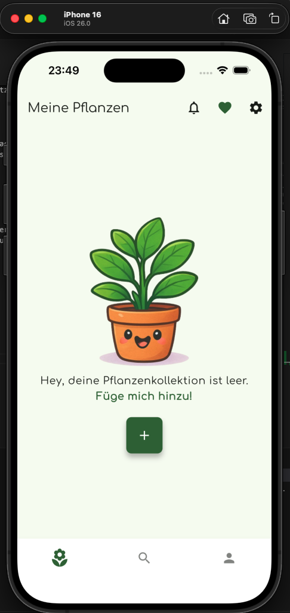
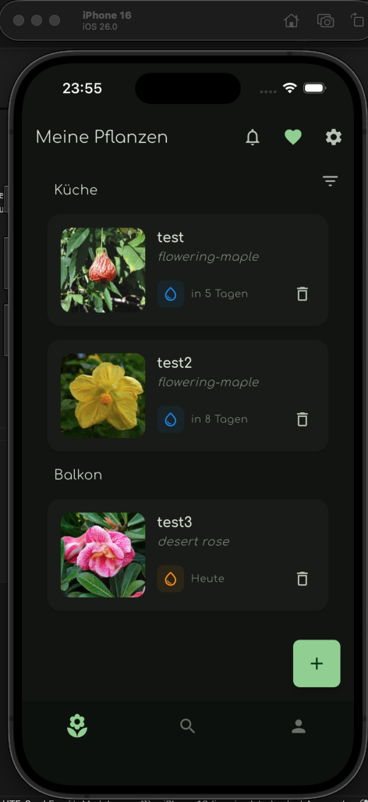
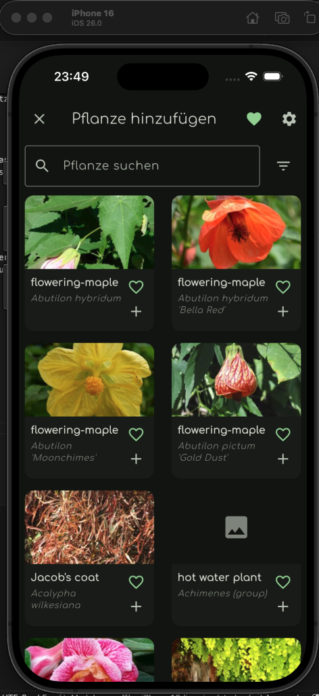
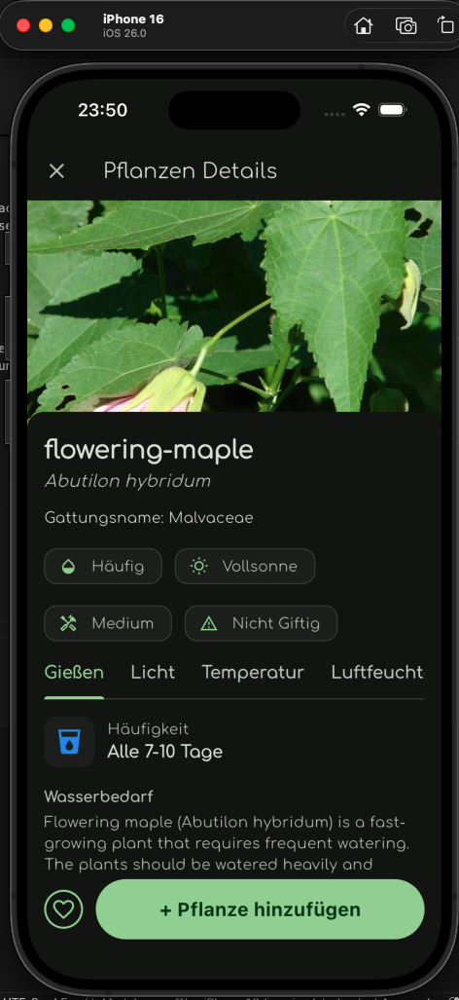
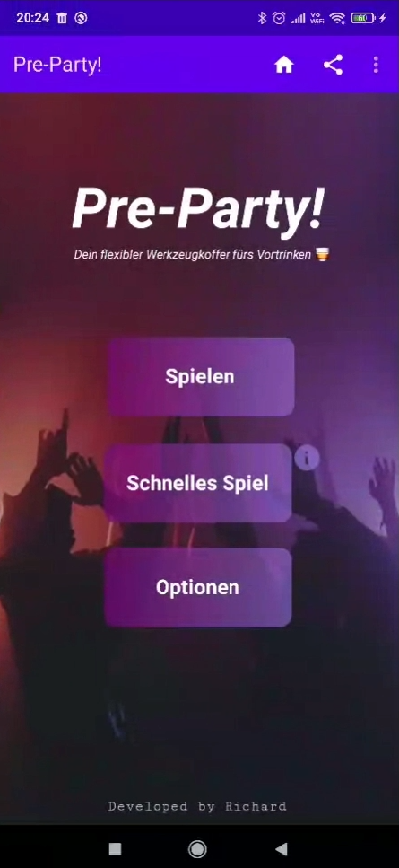
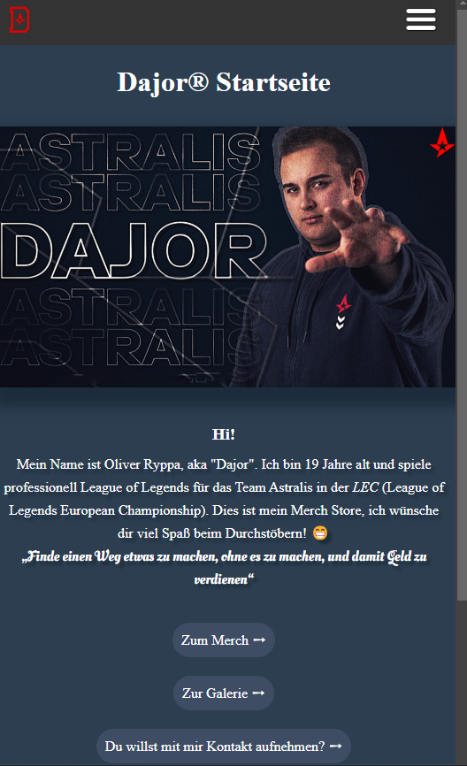
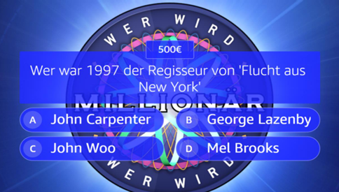
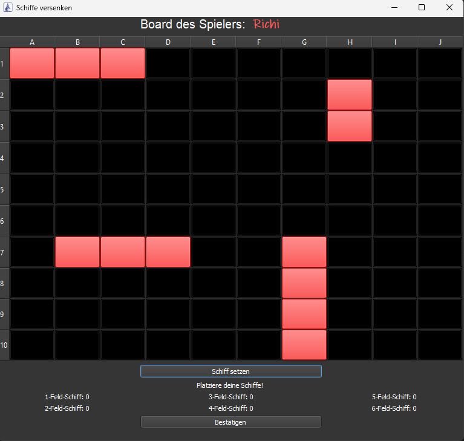

# Portfolio

Willkommen!

Hier befinden sich einige meiner privaten Projekte sowie Hochschulprojekte, die ich hier auf GitHub zusammentrage. Eine nähere Einsicht in die privaten Projekte und den Code ist nur auf Anfrage möglich.

Die Projekte sind in den Kategorien "Freizeit", "Bachelor" und "Master" unterteilt, aber weder in einer zeitlichen Reihenfolge noch nach Wichtigkeit geordnet.

---

 

## Master

### 📱🍃 Projekt 1: PlantPal MVP - Pflanzenverwaltungs-App in Flutter
#### HS Worms SoSe25, Modul: Mobile Application Frontend & Interaction Design (Teamprojekt: 3) - Note: 1.0

Frontend, Backend, Nutzerzentrierte Konzeption & Design -> "App-Store-Ready"

 
 

Tech-Stack: Flutter, Riverpod (State Management), Dart Mappable, Sembast (Local Database), Supabase (Backend Auth and Data Sync), Posthog (Analytics and User Behaviour Tracking), Go Router (Routing), Flutter Local Notifications, Perenual API (https://perenual.com/)

---

### 📊🤖 Projekt 2: Multi Class Classification durch Deep Learning
#### HS Worms SoSe25, Modul: Konzepte der KI in der Anwendung(Teamprojekt: 2) - Note: 1.7

Klassifikation von Pflanzenkrankheiten: Random Search Parameter Tuning, Callbacks, Data-Augmentation, Transfer-Learning, Finetuning, Evaluation, etc. von selbst entwickelten und vorhandener Modellen (z.B. ResNet-50)

Tech-Stack: Jupyter Notebook, Python, Numpy, Tensorflow/Keras, pandas, matplotlib, etc.

---

 

## Bachelor

### 📊🤖 Projekt 1: Machine Learning
#### HS Worms WiSe23/24, Modul: Machine Learning - Note: 2.0 

Clustering, Classification, Regression, Deep Learning (Classification Dogs vs Cats)

 
 
 

Tech-Stack: Jupyter Notebook, Python, Numpy, Tensorflow/Keras, pandas, matplotlib, etc.

---

### 📱🍻 Projekt 2: Trinkspiel-Android-App
#### HS Worms SoSe23, Modul: Entwicklung mobiler Anwendungen - Note: 2.7

Entwicklung einer Basic Mobile-App
  
  
  
Weitere Bilder: [Trinkspiel-App-Bilder](media/Trinkspiel-App/)  
Tech-Stack: Kotlin, AndroidStudio, SQLite

---

  

### 🌍 Projekt 3: Meine allererste entwickelte Website
#### HS Worms SoSe22, Modul: Webentwicklung (Teamprojekt: 2) - Note: 3.3

Anwendung der grundlegendsten Basics in Webentwicklung. Thema: Website für einen "Prominenten"

  

Weitere Bilder: [Dajor-Website-Bilder](media/Dajor-Website/)  
Tech-Stack: HTML, CSS, JS 

---

  

### 🤖🎤💰 Projekt 4: Wer-Wird-Millionär-Alexa-Skill
#### HS Worms WiSe22/23, Modul: Digitale Sprachassistenten (Teamprojekt: 3) - Note: 1.0

Entwicklung eines WWM-Alexa-Skills
  
  
Demovideo: [WWM-Demovideo](media/Alexa-Skill/Skill%20Showcase%20WWM.mp4)  
Tech-Stack: Python, SQLite, Alexa-Skill-Kit

  
---

  

### 🎮 Projekt 5: Schiffe Versenken 
#### HS Worms WiSe22/23, Modul: Programmierung Graphischer Oberflächen (Teamprojekt: 3) - Note: 1.7

Entwicklung des Spiels "Schiffe Versenken" als Desktopanwendung in PyQT5 

  

Weitere Bilder: [Schiffe-Versenken-Bilder](media/Schiffe-Versenken/)  
Tech-Stack: Python, PyQT5

  
---

  

### ✍🏻 Projekt 6: Bachelorarbeit  
#### HS Worms WiSe24/25 - Note: 1.3 

Analyse, Konzeption und prototypische Implementierung einer grafischen Benutzeroberfläche und funktionaler Erweiterungen für ein Automatisierungstool zur Installation & Konfiguration von Siemens Opcenter Execution Process

Keine Bilder o.ä., weil ein Sperrvermerk vorliegt  
Tech-Stack: C#, WPF (MVVM), Figma, PowerShell

  
---

  

### 🌍 Projekt 7: Fullstack WebShop
#### HS Worms SoSe23, Modul: Fullstack Webanwendungen (Teamprojekt: 3) - Note: 2.3

Entwicklung eines Fullstack-WebShops: Frontend & Backend

Tech-Stack: Nodejs, Docker, MariaDB, Express JS (API), Swagger UI (API Docs), Angular, TailwindCSS, Fontawesome, Jest (Unit-Tests)

  
---

  

### 📹 Projekt 8: Among-Us in Blender (HS Worms WiSe2022, Modul: 3D-Modellierung)
#### HS Worms WiSe22/23 (Teamprojekt: 2) - Note: 1.7

3D-Modellierung and Animation eines Among-Us-Kurzfilms in Blender

Kurzfilm: [Among-Us-Kurzfilm](media/Among-Us/AmongUsIncidentFilm.mp4)  
Tech-Stack: Blender, Camtasia  
  
---

  

### 🤖📧 Projekt 9: Automatischer E-Mail Beantworter "GeniusReply"
#### HS Worms SoSe24, Modul: Projektmanagement und Teamorientiertes Projekt (Teamprojekt: 7) - Unbenotet 

Entwicklung eines automatischen E-Mail Beantworters im achtwöchigen Vollzeitmodul "Teamorientiertes Projekt (TOP)"

https://top.pages.gitlab.rlp.net/24s/pmai/geniusreply/  
Tech-Stack: Python, LLMs, ChromaDB, JavaScript, MySQL, Nodejs

  

 

## Freizeit

### 🌍 Projekt 1: Ordinary-Website

Kleines Spaß-Projekt, deployte Website für Freunde bzw. E-Sports Team "Ordinary" (Mit Humor nehmen! 😄) (Noch in Entwicklung)

https://ordinary.eu.pythonanywhere.com/ordinary/  
Tech-Stack: HTML, CSS, JS, Django (Python), SQLite

